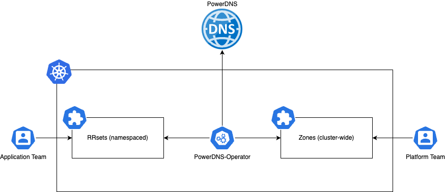

---
hide:
  - toc
---

# Introduction

**PowerDNS Operator** is a Kubernetes operator that manages PowerDNS service.

With PowerDNS Operator you can manage zones, records and other PowerDNS resources directly from Kubernetes. It is designed to be a simple and easy-to-use solution to manage PowerDNS directly from Kubernetes through Custom Resources. The PowerDNS service can be located inside or outside of Kubernetes, it does not matter since the Operator relies on the PowerDNS API.

!!! info
    This project use the official [PowerDNS API](https://doc.powerdns.com/authoritative/http-api/) and cannot be plugged to [PowerDNS-Admin](https://github.com/PowerDNS-Admin/PowerDNS-Admin) project which implement its own specific API on top PowerDNS's API. There is no issue if you want to use both projects together, but the operator can only relies on the official API and you may notice issues if you try to use PowerDNS-Admin to manage the same resources as the operator.

### Why use PowerDNS Operator?

We needed to offer DNS capabilities to users and considered relying on the PowerDNS-Admin project. However, we wanted a more flexible solution that could be natively integrated with our existing Kubernetes infrastructure. We were also looking for a solution that could be easily integrated with our GitOps workflow to automate the creation of DNS records as well as other resources such as Ingress, Services, etc.

Another reason is that the PowerDNS-Admin project is not in [good health](https://github.com/PowerDNS-Admin/PowerDNS-Admin/discussions/1708) and will probably be rewritten in the future. We wanted a solution that is more reliable and easily maintained.

The PowerDNS Operator is a convenient way to offer self-service DNS capabilities to users, allowing them to create resources directly in the Kubernetes cluster. Additionally, you can use Backstage or any Internal Developer Platform and connect it to the Kubernetes API server that contains the PowerDNS Operator if you don't want to grant direct access to the Kubernetes cluster.
