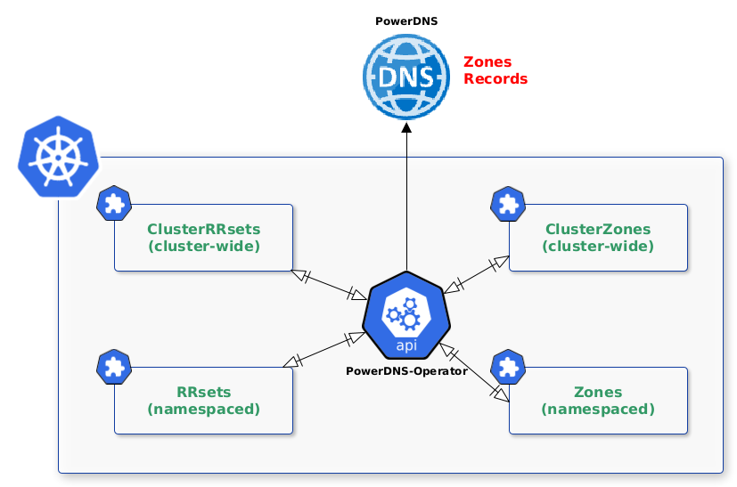

# API Overview

## Architecture



The PowerDNS-Operator extends Kubernetes with Custom Resources, which define **<font color="red">Zones</font>** and **<font color="red">Records</font>**. The controller fetches **<font color="green">ClusterZones</font>**, **<font color="green">Zones</font>**, **<font color="green">ClusterRRsets</font>** and **<font color="green">RRsets</font>** from the cluster and creates PowerDNS elements (**<font color="red">Zones</font>** and **<font color="red">Records</font>**). Each modification on these Custom Resources will be applied on PowerDNS instance accordingly.

## Resource Model


To understand the mechanics of the operator let's start with an example.

1. The `ClusterZone` resource, created by Platform Team, references a root Zone (example.org).
```yaml
--8<-- "clusterzone-example.org.yaml"
```
2. Some `ClusterRRsets` resources, created by Platofrm Team, can reference records related to the `ClusterZone` (such nameservers IPs, mail servers, SOA, ...).
```yaml
--8<-- "clusterrrsets-example.org.yaml"
```
3. The `Zone`, in the *'myapp1'* namespace, can be created by Application Team or Platform Team depending on the Authorization model choosen, reference a Sub-Zone for Application purposes.
```yaml
--8<-- "zone-myapp1.example.org.yaml"
```
4. The `RRsets` in the *'myapp1'* namespace, created by Application Team, reference services provided by the Application (frontend, backend, database, ...).
```yaml
--8<-- "rrsets-myapp1.example.org.yaml"
```

Such a structure allows a separation of elements, the application team can only administer the `RRsets` linked to its services

Each `RRset` refers to the ClusterZone/Zone it depends on.

## Behavior

The PowerDNS-Operator (PDNS-OP for brevity) reconciles `ClusterZones` or `Zones` in the following manner:

1. PDNS-OP verifies that no other `Zone` or `ClusterZone` already exists with the same FQDN (Fully Qualified Domain Name), if exists, `Zone`/`ClusterZone` status is defined as 'Failed'
2. PDNS-OP requests PowerDNS API to create/modify the corresponding resource
3. PDNS-OP requests PowerDNS API to create/modify related 'Nameservers' entries
4. PDNS-OP updates resource Status (including Serial) and its metrics

The PowerDNS-Operator reconciles `ClusterRRsets` or `RRsets` in the following manner:

1. PDNS-OP verifies that the corresponding `ClusterZone`/`Zone` already exists, if not, It schedule a new reconciliation later on
2. PDNS-OP verifies that the corresponding `ClusterZone`/`Zone` is not in 'Failed' status, in that case , `RRset` or `ClusterRRset` status is defined as 'Failed'
3. PDNS-OP requests PowerDNS API to create/modify the corresponding resource
4. PDNS-OP updates resource Status and its metrics
5. PDNS-OP schedule a reconciliation to update `ClusterZone`/`Zone` Status (including Serial)

## Roles and responsibilities

The PowerDNS-Operator is designed to target the following persona:

* Cluster Operator: The cluster operator is responsible for configuring PowerDNS instance, ,
* Platform Team: The Platform team is responsible for defining the architecture `ClusterZone`, `Zone`, `ClusterRRset` and `RRset`, setting the permissions for application team (e.g. permissions to create Zones in their namespaces),
* Application Team: The Application developer is responsible for defining `RRset` (eventually `Zone`) related to their services.

Each persona will roughly map to a Kubernetes RBAC role. Depending on your environment these roles can map to a single user. Note: The PowerDNS Operator does not manage the PowerDNS instance lifecycle.